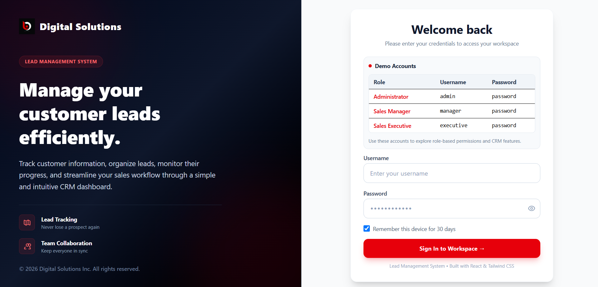
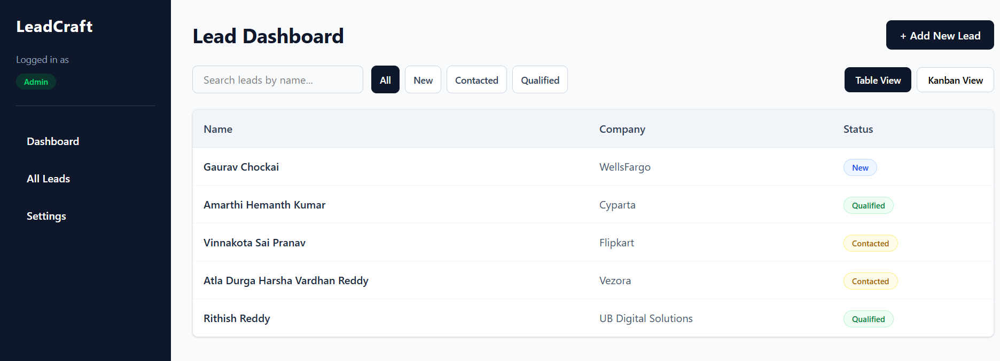
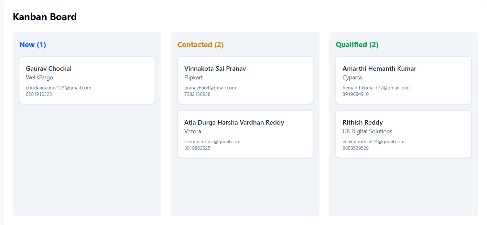
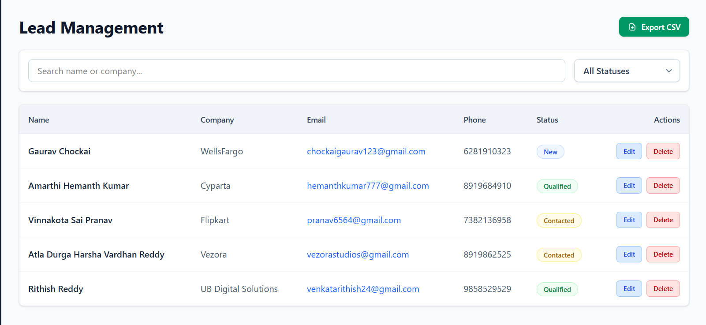

# LeadCraft SaaS CRM

A full-stack **Lead Management CRM** built using the **MERN Stack**. LeadCraft helps businesses manage customer leads through secure authentication, a drag-and-drop Kanban workflow, analytics dashboard, and complete CRUD operations.

## 🚀 Live Demo

**Frontend:** https://lead-craft-saa-s.vercel.app

> **Note:** Use the demo credentials provided below to log in.

**Backend:** https://leadcraft-saas.onrender.com

---

## 🛠️ Tech Stack

### Frontend
- React.js
- Vite
- Tailwind CSS
- Axios
- React Router DOM
- Recharts

### Backend
- Node.js
- Express.js
- JWT Authentication
- bcrypt.js

### Database
- MongoDB Atlas
- Mongoose

### Deployment
- Frontend: Vercel
- Backend: Render

---

## ✨ Features

- Secure JWT Authentication
- Role-Based Login
- Dashboard with Analytics
- Drag-and-Drop Kanban Board
- Add New Leads
- View All Leads
- Edit Existing Leads
- Delete Leads
- Search Leads
- CSV Import & Export
- Responsive User Interface
- MongoDB Atlas Integration

---

## 🔑 Demo Access

Use the following demo accounts to explore the application.

| Role | Username | Password |
|------|----------|----------|
| Admin | `admin` | `password` |
| Sales Manager | `manager` | `password` |
| Sales Executive | `executive` | `password` |

Each role has different permissions within the application.

---

## 📸 Screenshots


| Login | Dashboard |
|-------|-----------|
|  |  |

| Kanban Board | Lead Management |
|--------------|-----------------|
|  |  |
---


## 🔐 Role-Based Access Control

| Action | Admin | Sales Manager | Sales Executive |
|---------|:-----:|:-------------:|:---------------:|
| View Leads | ✅ | ✅ | ✅ |
| Search Leads | ✅ | ✅ | ✅ |
| Add New Lead | ✅ | ✅ | ❌ |
| Edit Lead | ✅ | ✅ | ❌ |
| Delete Lead | ✅ | ❌ | ❌ |
| Update Lead Status | ✅ | ✅ | ✅ |
| View Dashboard Analytics | ✅ | ✅ | ❌ |


---

## 🚀 Running Locally

### Prerequisites

Make sure you have the following installed:

- Node.js (v18 or later)
- npm
- MongoDB Atlas account (or a local MongoDB instance)

---

### 1. Clone the Repository

```bash
git clone https://github.com/YOUR_GITHUB_USERNAME/LeadCraft-SaaS.git
cd LeadCraft-SaaS
```

---

### 2. Backend Setup

```bash
cd server
npm install
```

Create a `.env` file inside the `server` folder.

```env
PORT=5000
MONGO_URI=your_mongodb_connection_string
JWT_SECRET=your_jwt_secret
```

Start the backend server:

```bash
npm start
```

---

### 3. Frontend Setup

Open another terminal.

```bash
cd client
npm install
npm run dev
```

The frontend will start on:

```
http://localhost:5173
```

The backend will run on:

```
http://localhost:5000
```

---

## 📝 Future Improvements

- Email notifications for lead updates
- Advanced lead filtering and sorting
- Activity logs for user actions
- Team collaboration features
- Mobile application
- AI-powered lead scoring and recommendations
- Dark/Light theme toggle

---

## 👨‍💻 Author

**N. Venkata Rithish Reddy**

- GitHub: https://github.com/rithish2413


---

## 📄 License

This project is licensed under the **MIT License**.

Feel free to use this project for learning and educational purposes.